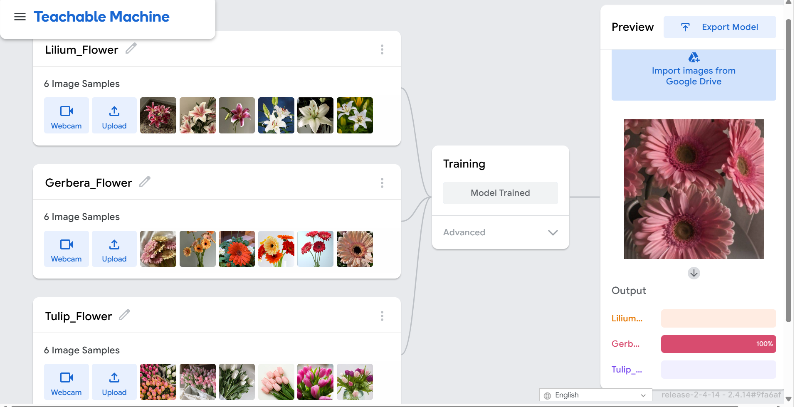

# AI-Flower-Recognition-Teachable-Machine
A machine learning project for flower image recognition using Google’s Teachable Machine and Python. Includes a trained TensorFlow/Keras model, dataset details, training accuracy screenshots, and a full prediction script tested in Google Colab.
# About This Project

This project focuses on building a flower image classification model using Google’s Teachable Machine and testing it in Google Colab with a custom Python script. The dataset includes three flower types, each trained with six images. The repository also contains screenshots showing the training accuracy and the final prediction results.

### Teachable Machine Output

---

## How the Model Was Built

In this project, I created a simple image recognition model that classifies three types of flowers: Tulip, Lilium (Lily), and Gerbera. Each class was trained using six images to give the model enough variation and help it learn meaningful visual features.

After preparing the dataset, I trained the model until it reached a strong accuracy level. A screenshot of the Teachable Machine training results is included to show the final performance.

Once the training was complete, I exported the model in TensorFlow → Keras format. This format works smoothly with Python and makes it easy to test the model in Google Colab. I loaded the exported files in Colab to ensure the model imported correctly.

The Python script performs the following steps:

- Loads the Keras model  
- Preprocesses the input image  
- Runs the prediction  
- Displays the predicted class and confidence score  

### Python Prediction Output

---

## Included Files

This repository contains:

- The trained machine learning model exported from Teachable Machine.  
- A label file that includes the names of the flower classes used in training.  
- A Python script used to load the model, preprocess images, and run predictions in Google Colab.  
- An external test image used to evaluate the model’s ability to classify samples it was not trained on.
